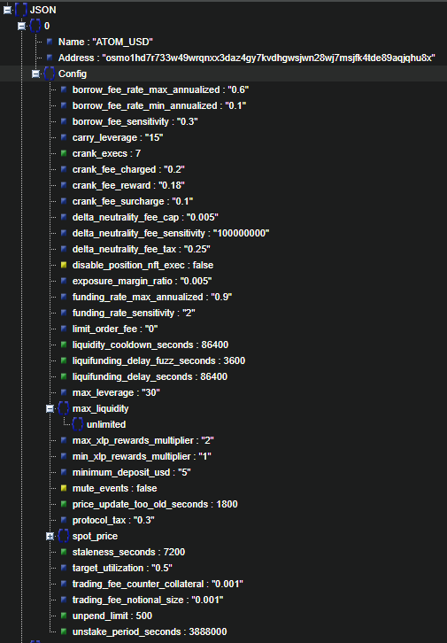

# Pull [Levana](https://levana.finance/) Market Info's with [Cosm.Net](https://github.com/PoolPirate/Cosm.Net)

## Prerequisites

- .NET SDK 8.0
  - Instructions on how to install [here](https://dotnet.microsoft.com/en-us/download)
- Nothing else

## Running

- Navigate to project root
- `dotnet run --project src\LevanaMarketGrab\LevanaMarketGrab.csproj`

## Output

### CLI

- List of all markets and their address
- Path to output json file

### Json File

- Array of market infos
- Format of each market in image below
- A (likely outdated) output file is included at the top level of this repository

